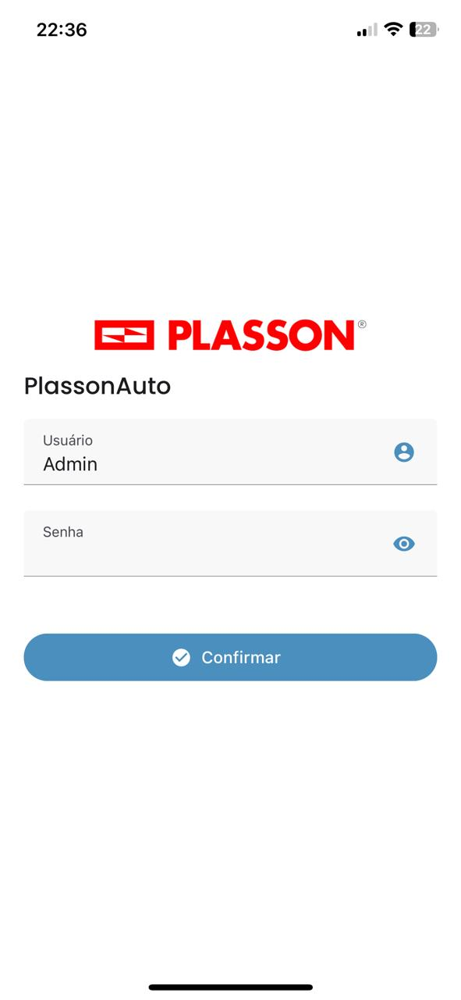
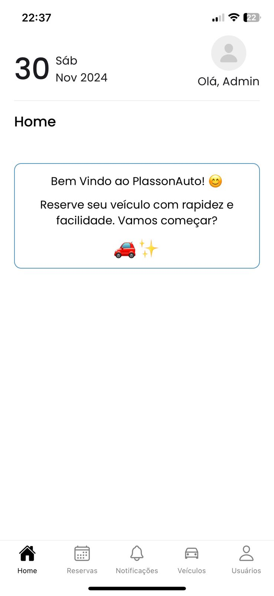
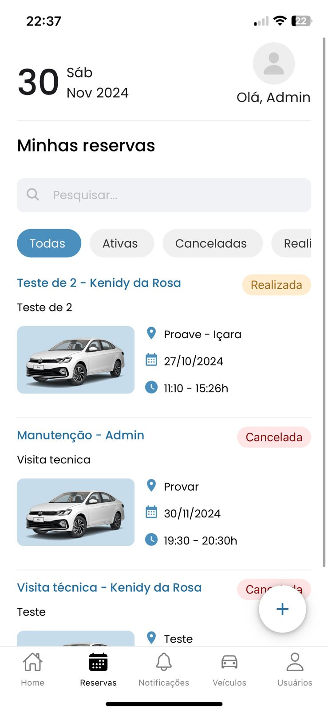
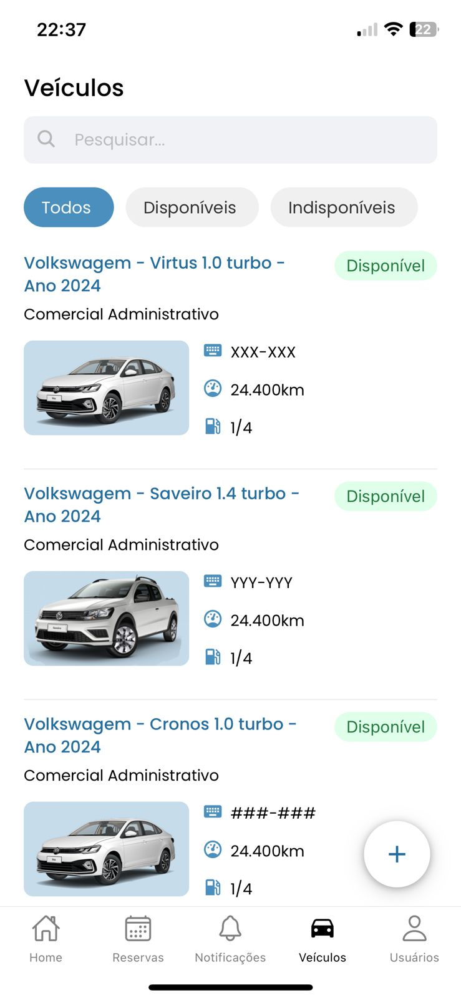
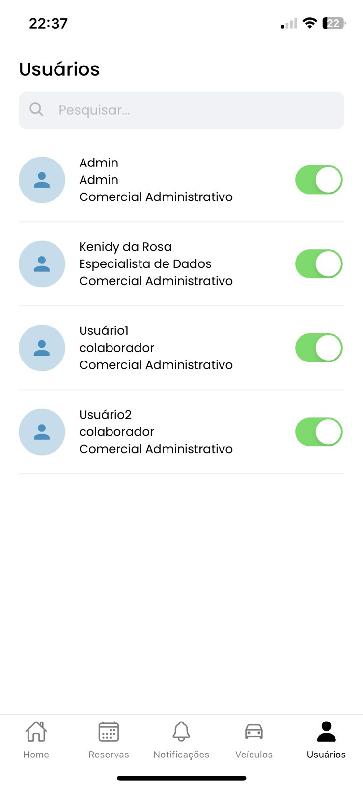
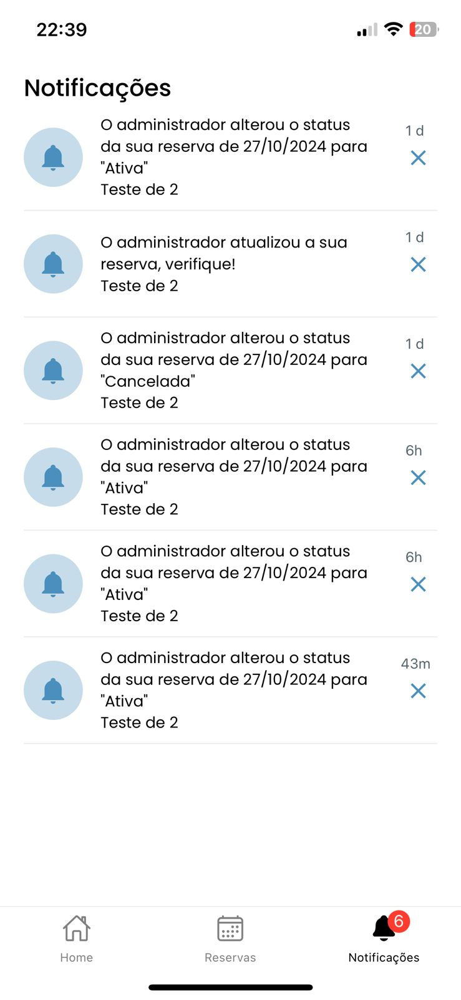
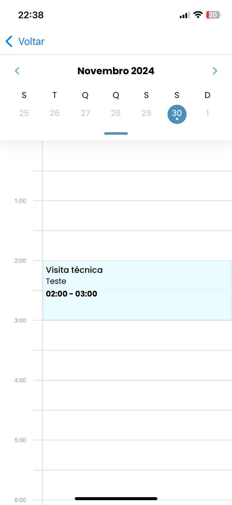

# Sistema de Reserva de Carros

Bem-vindo ao sistema de reserva de carros para Plasson do Brasil. Este aplicativo permite aos usuários realizar reservas de veículos de forma simples e prática, além de fornecer uma interface de administração para gerenciamento de usuários e veículos.

## 📋 Índice

- [Sobre o Projeto](#sobre-o-projeto)
- [Funcionalidades](#funcionalidades)
- [Tecnologias Utilizadas](#tecnologias-utilizadas)
- [Pré-requisitos](#pré-requisitos)
- [Instalação](#instalação)
- [Uso](#uso)
- [Contribuição](#contribuição)
- [Licença](#licença)
- [Contato](#contato)

## 📖 Sobre o Projeto

O sistema de reserva de carros foi desenvolvido para facilitar a gestão de reservas de veículos dentro da empresa. Os usuários podem acessar o sistema através de um login e, a partir de uma interface intuitiva, visualizar suas reservas e adicionar novas conforme a disponibilidade. Administradores têm acesso a funcionalidades adicionais, como o controle de acesso de usuários e a administração da frota de veículos.

## Telas do Aplicativo

# Imagens do App

## Telas do Aplicativo

  <!-- Linha 1 -->
  

    
    
  

  <!-- Linha 2 -->
  

    
    
  

  <!-- Linha 3 -->
  

    
    
  

  <!-- Linha 4 -->
  

    
    
  

  <!-- Linha 5 -->
  

    
    
  

  <!-- Linha 6 -->
  

    
  

## 🚀 Funcionalidades

### Usuário Comum
- **Login Seguro**: Acesso ao sistema por meio de login.
- **Visualização de Reservas**: Os usuários podem visualizar todas as reservas já feitas.
- **Criação de Novas Reservas**: Possibilidade de realizar novas reservas de veículos conforme disponibilidade.

### Administrador
- **Validação de Acessos**: Capacidade de validar o acesso de usuários selecionados.
- **Gerenciamento de Frota**: Cadastro, edição e remoção de veículos disponíveis para reserva.
- **Gestão de Usuários**: Adição e remoção de usuários, bem como a definição de permissões de acesso.

## 🛠️ Tecnologias Utilizadas

-- **Desenvolver**
- **Frontend**: [React-native, CSS, Expo]
- **Backend**: [Node.js, Express, SQLite, Firebase]
- **Banco de Dados**: SQLite
- **Versionamento de Código**: Git

## 📦 Pré-requisitos

Antes de começar, certifique-se de ter as seguintes ferramentas instaladas:

- [Node.js](https://nodejs.org/en/) (Versão 18.19.0)
- [Git](https://git-scm.com/)
- [Banco de Dados] (SQLite, ou baixar a extensão MySQL para VS Code)

## 📥 Instalação

1. Clone o repositório para sua máquina local:
   git clone https://github.com/kenidydarosa/plassonAuto.git

   Para rodar o frontend você pode rodar o comando o npx expo start
   para o backend você pode rodar o comando npm start

   Instale as dependências usando npm install

## 🖥️ Uso

### Acesso
Para fins de teste, você pode acessar o aplicativo com as seguintes credenciais:  
- **Login de Adminitrador**: `Admin`  
- **Login de usuário comum**: `Kenidy.rosa`  
- **Senha**: `1234`

### Resumo de Utilização

1. **Usuário Comum** 👤  
   - Acesse a **Página Inicial (Home)** 🏠.  
   - Consulte **Minhas Reservas** 📋 para visualizar e gerenciar suas próprias reservas.  
   - Confira **Notificações** 🔔 para receber alertas sobre o sistema e suas reservas.  
   - Realize novas reservas clicando no botão flutuante ➕, escolhendo o veículo e preenchendo o formulário.  

2. **Administrador** 🔑  
   - Além das funcionalidades de usuário comum, você pode:  
     - Gerenciar a aba **Veículos** 🚗 para cadastrar, editar ou inativar veículos.  
     - Controlar a aba **Usuários** 👥, alterando a permissão para entrar no sistema.  
     - Visualizar e editar **todas as reservas** 🛠️, mantendo o controle total do sistema.  

### Navegação
- Após o login, todos os usuários têm acesso à página inicial (**Home**) 🏠.  
- Usuários comuns podem gerenciar suas próprias reservas e visualizar notificações.  
- Administradores têm acesso adicional às abas de **Veículos**, **Usuários**, e podem visualizar e editar todas as reservas.

## 📞 Contato

- **Desenvolvedor**: Kenidy da Rosa  
- **E-mail**: [kenidyy@hotmail.com](mailto:kenidyy@hotmail.com)  
- **GitHub**: [github.com/kenidydarosa](https://github.com/kenidydarosa) 

